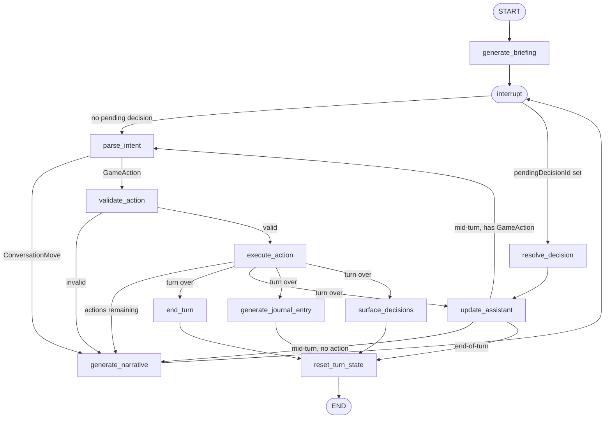

# LangGraph Graph Design — MooGPT

## Overview

MooGPT is a turn-based, chat-driven farming game. Each game turn (day) follows
the same two-phase structure:

1. **Daily briefing.** At the start of every game turn MooGPT opens with a spoken
   briefing — what the animals got up to overnight, how the market moved, any
   events that fired, and what decisions are pending. The player reads this
   before touching anything.
2. **Player actions.** The player then sends natural-language messages
   ("feed the cows", "sell my milk", "what should I do today?"). An **action**
   is defined as a successful game event — something that actually happened on
   the farm. Each successful action costs one or more slots from the turn's
   limited budget (determined by `turn.actionsRemaining`). Failed attempts
   (invalid requests, clarifications, queries) are not actions and do not cost
   budget. MooGPT interprets each message, validates it against game rules,
   mutates game state, and replies in character. When the action budget is
   exhausted the turn closes automatically.

The LangGraph graph drives both phases. It sits between the React UI (which
owns rendering and input) and the game state (which owns domain rules). One
graph run covers exactly one game turn (one day): it starts with the daily
briefing, interrupts repeatedly to wait for player input, and terminates when
the day ends. React starts a fresh graph run for the next day.

---

## Terminology

- **Game turn / Day:** The core game loop unit. One graph run covers exactly one game turn. The terms "game turn" and "day" are interchangeable throughout this document.
- **Conversation turn:** A single exchange — one player message and one MooGPT response. Multiple conversation turns happen within a single game turn (day).
- **Action:** A successful game event (something that happened on the farm). Only `GameAction` intents that pass validation and execute count against the daily action budget.
- **Conversation move:** A player message that does not change farm state (`query`, `clarify`). Never costs budget.
- **Decision:** A choice MooGPT surfaces to the player. Decisions are queued in `GameState.decisions` at end-of-turn by `surface_decisions` and presented in the next day's briefing. They do not need to be resolved in a fixed order. A decision may or may not map to a `GameAction` — if it does, resolving it costs a budget slot. By design, the number of pending decisions can exceed the day's action budget, forcing the player to prioritize.

---

## Graph State

See `src/agent/state.ts`.

---

## Nodes

### `generate_briefing`
**Purpose:** MooGPT delivers the daily briefing at the start of each turn.

- LLM call. Summarises what changed since the last turn: passive animal
  productivity ticks, market price shifts, any new `Decision` objects, and the
  current action budget.
- Tone follows `moogpt.personality`. Briefing is concise — one or two
  paragraphs max.
- Appends the briefing as an `AIMessage` to `messages`.
- After completing, the graph interrupts so the player can read and respond.

**Input:** `gameState`, `messages`
**Output:** new `messages` (with briefing appended)

---

### `parse_intent`
**Purpose:** Convert the raw user message into a structured `PlayerIntent`.

- Calls the LLM with a system prompt that explains available `GameAction` types
  and current game state (so the model knows what animals/products exist).
- Outputs `intent.type = "clarify"` when the message is ambiguous.
- Outputs `intent.type = "query"` for questions that don't change farm state.
- Never mutates `gameState` — read-only.

**Input:** `messages`, `gameState`
**Output:** `intent`

---

### `validate_action`
**Purpose:** Check whether the parsed `GameAction` is legal given current game state.

- Only reached when `intent.type` is a `GameAction` — `ConversationMove`s
  short-circuit to `generate_narrative` before this node.
- Pure TypeScript, no LLM call. Fast and deterministic.
- Checks: enough gold, enough `actionsRemaining`, target animal/product exists,
  market price > 0, etc.
- Sets `validationError` on failure. A failed validation is not an action — it
  does not cost budget.

**Input:** `intent`, `gameState`
**Output:** `validationError`

---

### `execute_action`
**Purpose:** Apply the action to `gameState`.

- Pure TypeScript domain logic (lives in `src/game/actions.ts`).
- Reduces `actionsRemaining`, modifies animals/market/gold/reputation.
- Accumulates `appliedDeltas` for the narrative node to reference.
- Sets `shouldEndTurn = true` when `actionsRemaining` hits 0.

**Input:** `intent`, `gameState`
**Output:** mutated `gameState`, `appliedDeltas`, `shouldEndTurn`

---

### `generate_narrative`
**Purpose:** MooGPT writes an in-character response to the player.

- LLM call. Tone is determined by `moogpt.personality` (cautious / helpful /
  sassy), and `moogpt.trust` is passed in context.
- Receives `appliedDeltas` so it can mention specific outcomes ("Bessie gave
  3 jugs of milk — nice work!").
- Receives `validationError` when routing from the error path so it can refuse
  warmly ("I wouldn't do that if I were you — you can't afford the feed!").
- May optionally present options for a pending `Decision`. When it does, it sets
  `pendingDecisionId` so the next input is routed through `resolve_decision`
  rather than `parse_intent`. It does not always present decisions.
- Appends the response as an `AIMessage` to `messages`.

**Input:** `gameState`, `appliedDeltas`, `validationError`, `intent`
**Output:** new `messages` (with assistant reply appended)

---

### `resolve_decision`
**Purpose:** Interpret the player's response in the context of a presented decision.

- Only reached when `pendingDecisionId` is set — i.e. `generate_narrative` just
  presented decision options and the player has responded.
- LLM call (or simple lookup). Determines which choice the player made
  (`choiceIndex`) by matching their response against the decision options.
- Clears `pendingDecisionId`.
- Applies any trust delta from the chosen option, then routes to
  `update_assistant` (which re-derives personality from the updated trust).
- After `update_assistant`:
  - If the chosen option maps to a `GameAction` → routes to `parse_intent`,
    then continues through `validate_action` → `execute_action` normally. The
    action costs a budget slot.
  - If the chosen option has no associated `GameAction` (e.g. "wait and see")
    → routes directly to `generate_narrative`. No budget consumed.
- Note: the player's message may also skip `resolve_decision` entirely and flow
  through `parse_intent` as a regular command (e.g. typing "call the vet"
  without explicitly acknowledging the decision prompt). Both paths are valid.

**Input:** `messages`, `gameState`, `pendingDecisionId`
**Output:** `intent` (if action follows) or mutated `gameState` (if no action)

---

### `generate_journal_entry`
**Purpose:** Write the turn's `JournalEntry` at end-of-turn.

- LLM call. Produces `title`, `body`, and `mood` for the journal.
- Only runs at end-of-turn (after `end_turn`).
- Summarizes what happened across the whole turn.

**Input:** `gameState`, `appliedDeltas` (all deltas for the turn)
**Output:** `newJournalEntry`

---

### `surface_decisions`
**Purpose:** Decide whether the current game state should generate new pending
`Decision` objects.

- LLM call (or rule-based initially). Checks thresholds and narrative triggers:
  sick animal → vet decision, low gold → market suggestion, season change →
  crop-planting event.
- Returns 0–N new `Decision` objects.

**Input:** `gameState`
**Output:** `newDecisions`

---

### `end_turn`
**Purpose:** Advance the turn counter and season.

- Pure TypeScript. Resets `actionsRemaining` to `actionsBudget`.
- Increments `turnNumber`. Advances `season` every 30 turns.
- Ticks animal ages, applies passive productivity changes.
- Updates `moogpt.trust` drift (trust decays slightly each turn if the player
  ignores MooGPT's opinions).

**Input:** `gameState`
**Output:** mutated `gameState`

---

### `reset_turn_state`
**Purpose:** Clear per-turn state after all end-of-turn processing is complete.

- Pure TypeScript. Runs sequentially after `end_turn`, `update_assistant`,
  `generate_journal_entry`, and `surface_decisions` have all converged.
- Clears turn-scoped fields in `GameState` (e.g. `currentTurnDeltas`) and
  `GraphState` (`appliedDeltas`, `validationError`, `intent`, `shouldEndTurn`,
  `pendingDecisionId`).
- After this node, the graph terminates (`END`). React writes the cleaned
  `GameState` to `localStorage` and starts a fresh graph run for the next turn.

**Input:** `GraphState`, `gameState`
**Output:** reset fields in both `GraphState` and `gameState`

---

### `update_assistant`
**Purpose:** Re-derive `moogpt.personality` from `moogpt.trust` and apply
end-of-turn trust drift.

- Pure TypeScript.
- **Personality thresholds:** 0–30 → `cautious`, 31–70 → `helpful`, 71–100 → `sassy`.
- **Trust drift (end-of-turn only):** Trust increases slightly when the player
  follows MooGPT's suggestions; trust decays slightly when the player ignores
  them. The net delta is computed from `appliedDeltas` and any pending decisions
  the player chose to defer.
- Runs in two contexts:
  1. **Mid-turn:** Immediately after `resolve_decision` applies a trust delta.
     Routes to `parse_intent` (if the decision mapped to a `GameAction`) or
     `generate_narrative` (if no action).
  2. **End-of-turn:** As part of the parallel fan-out when `shouldEndTurn ==
     true`. Applies trust drift for the full day, then routes to
     `reset_turn_state`.

**Input:** `gameState`, `appliedDeltas` (end-of-turn only)
**Output:** mutated `gameState.moogpt.personality`, `gameState.moogpt.trust`

---

## Graph Diagram



---

## Edges & Routing

```
START
  └─► generate_briefing ──► interrupt()
                                  │
                    ┌─────────────┴──────────────────────┐
                    │ pendingDecisionId set               │ otherwise
                    ▼                                     ▼
           resolve_decision                          parse_intent
                    │                                     │
                    └──► update_assistant                 ├─[ConversationMove]──► generate_narrative
                              │                           │
                              ├─[has GameAction]──► parse_intent
                              │                           └─[GameAction]──► validate_action
                              └─[no action]──► generate_narrative                │
                                                    │                            ├─[invalid]──► generate_narrative
                                               interrupt()                       │
                                                    │                            └─[valid]──► execute_action
                                          [next player input]                                       │
                                                                                                    ├─[shouldEndTurn == false]──► generate_narrative
                                                                                                    │
                                                                                                    └─[shouldEndTurn == true]
                                                                                                          ├─► end_turn ──────────────┐
                                                                                                          ├─► update_assistant ──────┤
                                                                                                          ├─► generate_journal_entry ┤
                                                                                                          └─► surface_decisions ─────┘
                                                                                                                                     │
                                                                                                                            reset_turn_state
                                                                                                                                     │
                                                                                                                                    END
```

One graph run = one turn. `interrupt()` is the single pause point where control
returns to the player. After each `generate_narrative` the graph interrupts; on
resume it routes to `resolve_decision` if the narrative presented a decision, or
`parse_intent` otherwise. The end-of-turn parallel nodes converge at
`reset_turn_state`, which clears turn-scoped state and terminates the graph.
React writes the cleaned `GameState` to `localStorage` and starts a fresh run
for the next turn.

---

## LLM Calls Summary

| Node                    | Model call? | Prompt style                     |
|-------------------------|-------------|----------------------------------|
| `generate_briefing`     | Yes         | Free prose, in-character         |
| `parse_intent`          | Yes         | Tool-calling (structured output) |
| `resolve_decision`      | Yes         | Tool-calling (structured output) |
| `validate_action`       | No          | —                                |
| `execute_action`        | No          | —                                |
| `generate_narrative`    | Yes         | Free prose, in-character         |
| `generate_journal_entry`| Yes         | Narrative prose                  |
| `surface_decisions`     | No          | Rule-based thresholds            |
| `end_turn`              | No          | —                                |
| `update_assistant`      | No          | —                                |
| `reset_turn_state`      | No          | —                                |

All LLM calls target the player-configured Ollama endpoint. Because the models
are small (e.g. llama3, mistral), `parse_intent` uses tool-calling rather than
JSON mode — small models are more reliable when given an explicit tool schema
than when asked to emit raw JSON.

---

## Runtime & Persistence

**Graph runs in the browser.** LangGraph.js executes entirely client-side — no
server required. The game is a pure front-end app.

**Ollama endpoint.** Players configure a local Ollama endpoint (e.g.
`http://localhost:11434`) in app settings before starting. The LangGraph `ChatOllama`
client uses this base URL for all LLM calls. The endpoint is stored in
`localStorage` alongside game state.

**Persistence via `localStorage`.** When a turn's graph run terminates (at
`END`), React receives the final `{ gameState, messages }`, serializes them, and
writes to `localStorage`. On page load, React hydrates from `localStorage` and
starts a fresh graph run for the current turn.

**Per-turn checkpointing.** Within a single game turn, the graph uses an
in-memory `MemorySaver` checkpointer to support the interrupt/resume loop. This
is intentionally not persisted to `localStorage`. If the player reloads
mid-turn, the graph is reconstructed fresh and the turn restarts from the
briefing — `GameState` (gold, animals, `actionsRemaining`, etc.) is preserved,
but any unfinished action sequence is discarded. This is an acceptable
trade-off given the lightweight, client-side-only architecture.

**Short-term memory.** `JournalEntry` objects and the `Decision` history act as
short-term memory — they persist across days and give the LLM context for
briefings and narrative.

**Long-term memory (deferred).** A mechanism that periodically compresses
journal entries and decision history into a summarised narrative for the model
to reference is planned but excluded from the initial version.

---

## Moo Mode (No Endpoint Configured)

If the player has not provided an Ollama endpoint, the graph runs in **Moo
Mode**: all LLM nodes are bypassed and replaced with a deterministic mock that
imitates a cow who only speaks in moos.

Behavior per node:

| Node                    | Moo Mode behavior                                              |
|-------------------------|----------------------------------------------------------------|
| `parse_intent`          | Returns a random valid `GameAction` chosen uniformly at random |
| `generate_briefing`     | Returns a string of random moos with random punctuation        |
| `generate_narrative`    | Returns a string of random moos with random punctuation        |
| `generate_journal_entry`| Returns a string of random moos with random punctuation        |
| `surface_decisions`     | Unchanged — rule-based, no LLM                                 |
| `update_assistant`      | Unchanged — pure TypeScript, no LLM                            |

Moo strings are generated by sampling a random count (e.g. 3–12) of the word
"moo" separated by spaces, then inserting random punctuation (`.`, `,`, `!`,
`?`) at random positions. Example output: `"moo moo! moo moo, moo moo moo moo?"`

Moo Mode is a playful fallback for players who haven't set up Ollama yet.

---

## Integration with React

- The graph is compiled once on app load with an in-memory `MemorySaver`
  checkpointer. Each turn gets a new `thread_id`.
- At turn start, React calls `graph.invoke(turnStartSignal, { configurable: { thread_id } })`.
  Each subsequent player message resumes the same run via another `graph.invoke`
  with the same `thread_id`. The graph resumes from `interrupt()`, processes
  the message, and either interrupts again or terminates at `END`.
- When the graph terminates, React receives the final state, writes to
  `localStorage`, and starts a new turn with a fresh `thread_id`.
- No streaming on the first pass — the full response is returned together so
  the UI can animate the journal, decisions, and chat message in sequence.
