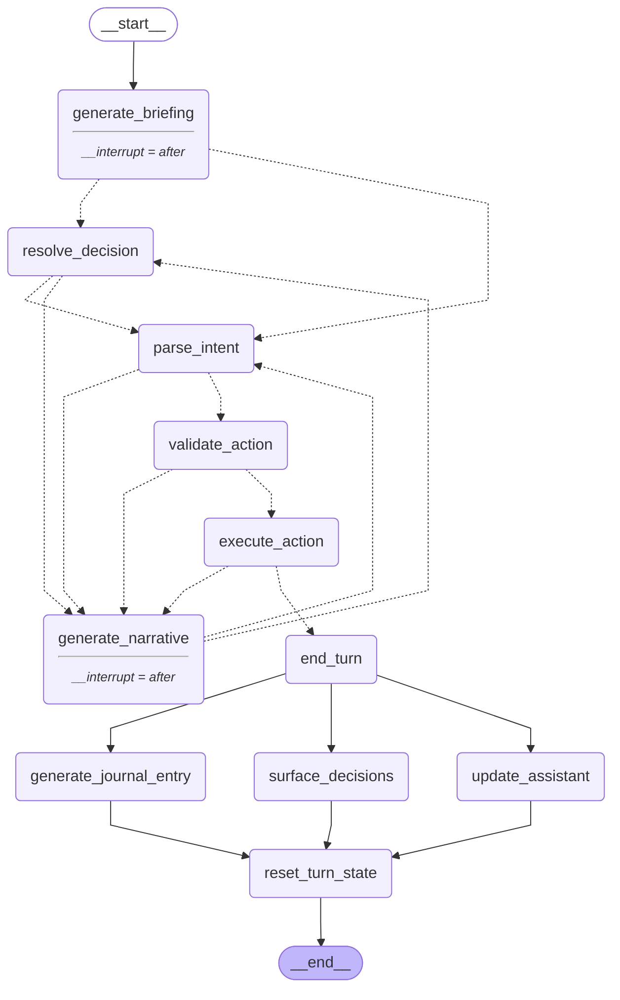

# MooGPT — LangGraph Diagram

> Auto-generated by `npm run update:graph`. Do not edit manually.

## Graph

---

## Nodes

### `generate_briefing`

**Purpose:** MooGPT delivers the daily briefing at the start of each turn.

LLM call. Summarizes what changed since the last turn: passive animal productivity ticks, market price shifts, any new Decision objects, and the current action budget. Tone follows moogpt.personality — concise, one or two paragraphs max. Appends the briefing as an AIMessage to messages. Graph interrupts after so the player can read and respond.

**Inputs:** gameState, messages

**Outputs:** messages (briefing AIMessage appended)

---

### `parse_intent`

**Purpose:** Convert the latest player message into a structured PlayerIntent.

LLM call using tool-calling / structured output. Reads available GameAction types and current game state so the model knows what animals and products exist. Emits intent.type = 'clarify' when the message is ambiguous, or 'query' for questions that don't change farm state. Never mutates gameState — read-only.

**Inputs:** messages, gameState

**Outputs:** ephemeralState.currentIntent

---

### `validate_action`

**Purpose:** Check whether the parsed GameAction is legal given current game state.

Pure TypeScript — no LLM. Only reached when intent.type is a GameAction; ConversationMoves short-circuit to generate_narrative before this node. Checks: sufficient gold, sufficient actionsRemaining, target animal/product exists, market price > 0, etc. A failed validation does not cost a budget slot.

**Inputs:** ephemeralState.currentIntent, gameState

**Outputs:** ephemeralState.validationError (null on success)

---

### `execute_action`

**Purpose:** Apply the validated GameAction to gameState.

Pure TypeScript domain logic (src/game/actions.ts). Decrements actionsRemaining, modifies animals/market/gold/reputation. Appends a StateDelta to appliedDeltas for generate_narrative and generate_journal_entry to reference. Sets shouldEndTurn = true when actionsRemaining hits 0.

**Inputs:** ephemeralState.currentIntent, gameState

**Outputs:** gameState (mutated), ephemeralState.appliedDeltas (appended), ephemeralState.shouldEndTurn

---

### `generate_narrative`

**Purpose:** MooGPT writes an in-character response to the player.

LLM call. Tone is determined by moogpt.personality and moogpt.trust. On the success path, receives appliedDeltas to mention specific outcomes. On the error path, receives validationError to refuse warmly. May optionally present a pending Decision — when it does, sets pendingDecisionId so the next player message routes through resolve_decision. Appends an AIMessage to messages. Graph interrupts after.

**Inputs:** gameState, ephemeralState.appliedDeltas, ephemeralState.validationError, ephemeralState.currentIntent

**Outputs:** messages (response AIMessage appended), ephemeralState.pendingDecisionId (optional)

---

### `resolve_decision`

**Purpose:** Interpret the player's response in the context of a presented decision.

LLM call (or simple lookup). Only reached when pendingDecisionId is set. Matches the player's message against the decision options to determine which choice was made. Clears pendingDecisionId. Accumulates the trust delta from the chosen option into ephemeralState for update_assistant to apply at end-of-turn. Routes directly to parse_intent if the chosen option maps to a GameAction, or to generate_narrative if the choice has no associated action.

**Inputs:** messages, gameState, ephemeralState.pendingDecisionId

**Outputs:** ephemeralState.currentIntent (if action follows), ephemeralState.pendingTrustDelta (accumulated)

---

### `generate_journal_entry`

**Purpose:** Write the turn's JournalEntry at end-of-turn.

LLM call — narrative prose. Runs only at end-of-turn as part of the parallel fan-out after end_turn. Produces title, body, and mood summarising what happened across the whole turn.

**Inputs:** gameState, ephemeralState.appliedDeltas

**Outputs:** gameState.journalEntries (new entry appended)

---

### `surface_decisions`

**Purpose:** Generate new pending Decision objects based on current game state.

Rule-based — no LLM. Runs only at end-of-turn as part of the parallel fan-out after end_turn. Checks thresholds and narrative triggers: sick animal → vet decision, low gold → market suggestion, season change → crop-planting event. Returns 0–N new Decision objects.

**Inputs:** gameState

**Outputs:** gameState.decisions (new decisions appended)

---

### `end_turn`

**Purpose:** Advance the turn counter and commit end-of-day state mutations.

Pure TypeScript — no LLM. Increments turnNumber, resets actionsRemaining to actionsBudget, advances season every 30 turns, ticks animal ages, and applies passive productivity changes. Runs before the parallel fan-out so downstream nodes (generate_journal_entry, surface_decisions, update_assistant) all see the updated state.

**Inputs:** gameState

**Outputs:** gameState (turnNumber, actionsRemaining, season, animal ages mutated)

---

### `update_assistant`

**Purpose:** Apply accumulated trust deltas and re-derive MooGPT's personality.

Pure TypeScript — no LLM. Runs only at end-of-turn as part of the parallel fan-out after end_turn. Applies the trust deltas accumulated across the day (from resolve_decision calls and deferred decisions), applies end-of-turn trust drift, then re-derives moogpt.personality from the updated trust score: 0–30 → cautious, 31–70 → helpful, 71–100 → sassy.

**Inputs:** gameState, ephemeralState.appliedDeltas, ephemeralState.pendingTrustDelta

**Outputs:** gameState.moogpt.trust (updated), gameState.moogpt.personality (re-derived)

---

### `reset_turn_state`

**Purpose:** Clear all turn-scoped state so the graph can terminate cleanly.

Pure TypeScript — no LLM. Runs after all end-of-turn nodes converge at this node. Clears ephemeralState fields (appliedDeltas, validationError, currentIntent, shouldEndTurn, pendingDecisionId, pendingTrustDelta). After this node the graph terminates at END — React writes the cleaned gameState to localStorage and starts a fresh graph run for the next turn.

**Inputs:** ephemeralState, gameState

**Outputs:** ephemeralState (all fields reset)
