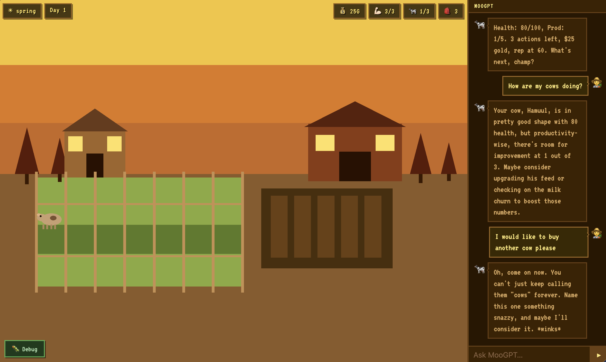
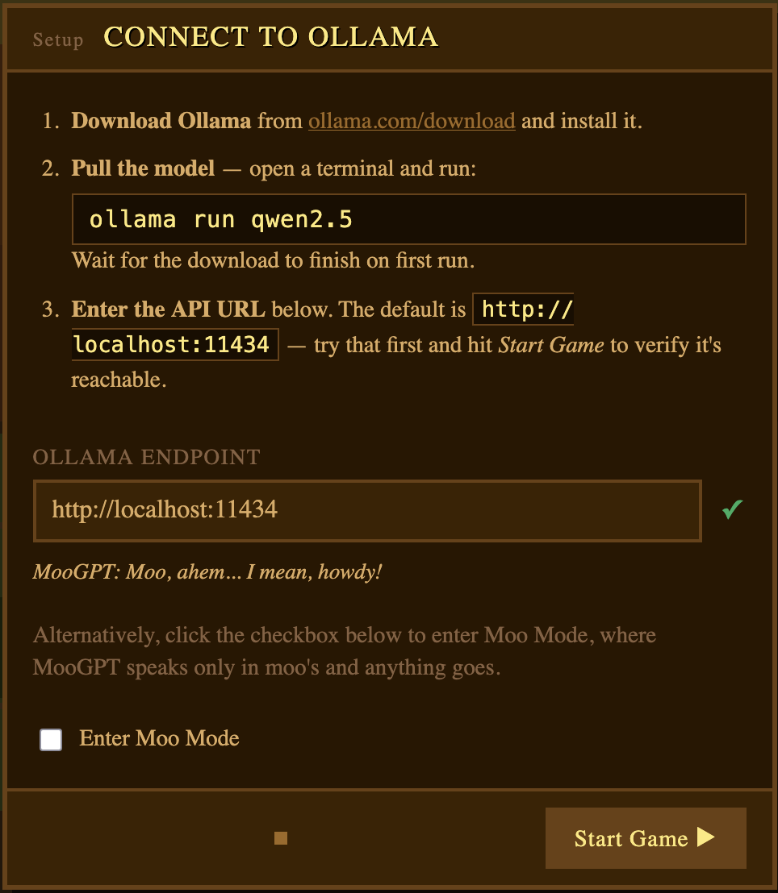

# MooGPT 🐄 - The AI Farming Game

Harvest Moon lovers, rejoice! It's 2026 and your farm runs on vibes now (and completely in your browser).

MooGPT is a chat-driven farming game where **you don't control a character - you chat with one**. 

Just tell your trusty AI advisor MooGPT 🐄 what to do, and what your farm come to life.
Plant crops (coming soon!), wrangle chickens (coming soon!), sweat-talk your cows - all without lifting a virtual hoe!

No more grinding. No more button mashing. Just you, your words, and an AI cow that listens.

> "Ship your crops, not your sanity."

## Getting Started

1. Launch the game at https://treble-maker123.github.io/moo-gpt/,
2. Follow the instructions and have fun!

 

## FAQs

**Q: How does the game work?**

**A:** In MooGPT, you play an aspiring entrepreneur who inherited a dilapidated farm from your grandparents. 
Unlike the farmers of old, you have your trusty AI assistant - MooGPT 🐄 will handle all the dirty work: planting
the seeds, scooping out the cow poop, shearing the sheep, and more. Just direct your assistant on what to do each day
(within your daily budget) and watch your farm flourish! Or perish (because capitalism giveth, capitalism takes)...

---

**Q: Are there any prerequisites to running the game?**

**A:** You will need to have Ollama installed locally on your computer. 
The setup screen will guide you through setup and verify that everything is working correctly.

---

**Q: What if I don't want to install Ollama?**

**A:** You can ditch the intelligence and enjoy the game in **Moo Mode**, where MooGPT only talks in moo's and anything goes, because all actions are random.
To activate **Moo Mode**, simply leave the `Ollama Endpoint` field blank.

## Contributing

MooGPT is open source and I would love your help! Whether you're here to play, build, or just vibe - you're welcome on the farm. 👨‍🌾